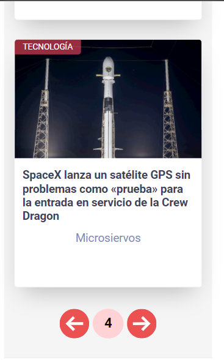

# News Feeds

[live demo](https://gusV15.github.io/news-feeds/)

## Build using:

- Embedded React
- lifecycle methods
- Redux
- Redux thunk for fetch api
- CSS in JS (styled-components)
- Responsive Web Design
- HTML5

## Required:

- Node.js

## How to run the project:

- `npm install` to install dependencies

## License

- MIT
